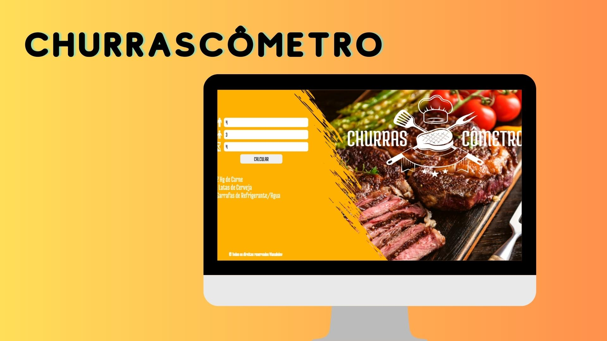

<h1 align="center"> Projeto Churrascometro</h1>

Churrascômetro irá calcular a carne e bebidas para um churrasco conforme a quantidade adultos/crianças e a duração do churrasco. 

  <a href="#-tecnologias">Tecnologias</a>&nbsp;&nbsp;&nbsp;|&nbsp;&nbsp;&nbsp;
  <a href="#-projeto">Projeto</a>&nbsp;&nbsp;&nbsp;|&nbsp;&nbsp;&nbsp;
  <a href="#memo-licença">Licença</a>

  

 

  

## 🚀 Tecnologias

Esse projeto foi desenvolvido com as seguintes tecnologias:

- HTML e CSS
- JavaScript
- Git e Github

## 💻 Projeto

O Projeto Churrascometro é uma página Web criada como forma de agregar conhecimento.

- [Acesse o projeto finalizado, online](https://Vianahdev.github.io/Projeto-Churrascometro/)

## :memo: Licença

Esse projeto está sob a licença MIT.
